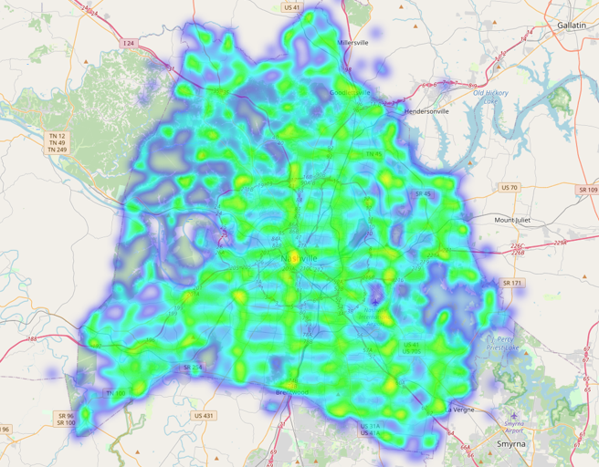

# 🚔 From Calls to Crimes: Analyzing Public Safety Trends in Nashville

**Capstone Project | Nashville Software School (NSS)**  
Exploring how public safety data helps us understand neighborhood trends and support smarter, data-driven decisions for a safer city.

---

## 📖 Executive Summary
This project examines 911 call and police-reported crime data from the Metro Nashville Police Department between 2018 and 2021.
By combining geospatial and time-series analysis, it identifies patterns, hotspots, and behavioral trends that reveal how call activity varies by location, time, and shift — supporting better public safety planning and resource allocation.

---

## 🧭 Motivation
Nashville has experienced rapid population and economic growth in recent years.
With this expansion, understanding where and when incidents occur becomes critical for public safety planning.

This project aims to:

Reveal neighborhood-level differences in incident types and volume

Connect 911 call data with crime confirmation outcomes

Provide insights for smarter shift scheduling and patrol strategies

---

## 📊 Datasets
| Dataset | Description | Source |
|----------|--------------|--------|
| Metro Police Department Incidents (2018–2021) | Crime data by type, time, and ZIP code | Metro Nashville Open Data Portal |
| 911 Calls for Service (2018–2021) | Citizen-reported safety and service issues | HubNashville |
| Fines and Violations | Public sanitation fines and collection outcomes | HubNashville |
| Geospatial Boundaries | ZIP code and district shapefiles | MNPD Open Data |

---

## ⚙️ Technologies Used
**Languages:** Python, SQL  
**Libraries:** Pandas, Folium, Matplotlib, GeoPandas  
**Tools:** Power BI, PostgreSQL, Docker, Jupyter Notebook  

---

## 🔍 Key Questions
- 1. What are the most frequent incident types by ZIP code?
- 2. How do 911 calls correlate with confirmed crimes?
- 3. What times of day and days of the week show the highest activity?
- 4. Which ZIP codes and precincts report the most growth?
- 5. How have call volumes shifted over the years and across shifts?
---

## 🗺️ Visualizations
- 🧭 **Folium Heatmap**: Hotspots of crime and 911 calls across ZIP codes  
- 📈 **Power BI Dashboard**: Interactive view of trends, routes, and fines  
- 🕒 **Time-Series Charts**: Monthly and daily trends of incidents  
- 🧮 **ZIP Comparison Matrix**: Contractor vs Metro performance metrics  

---
## ⚙️ Tools & Techniques

- Languages & Libraries: Python (Pandas, GeoPandas, Folium)
- Visualization Tools: Power BI, Matplotlib, Seaborn
- Data Process: Cleaning → Aggregation → Geospatial Mapping → Time-Series Analysis
---
### 🗺️ Nashville ZIP Code Map

This map outlines major ZIP code areas in Nashville, providing geographic context for public safety analysis.  
It helps identify spatial patterns across neighborhoods and visualize call distribution by area.

---

## 💡 Insights
🔹 ZIP Code Growth Trends
| Year | Highlight | Key ZIPs |
|----------|--------------|--------|
|2019 vs 2018 |	37135 (Nolensville) recorded the highest growth rate (+2.0), showing strong regional development.|	37135, 37203, 37209 |
|2020 vs 2019 |	37086 (La Vergne) and 37143 showed over 100% increase in calls — possibly due to population shifts and local events.	|37086, 37143, 37232 |
|2021 vs 2020	|Continued high growth in fast-developing suburban and business zones.|37208, 37210, 37207 |

---

### 🚨 Crime Confirmation Patterns

**Theft** ranks highest with a **55.3%** confirmation rate, followed by **Missing Person (23.1%)** and **Escaped Prisoner (21.4%)**.  
These categories represent the most resource-intensive and high-priority response types.

---

## 🔹 Call Trends by Shift (2018–2021)

- Shift A (6 AM – 2 PM): Handles the most calls, especially during Spring.
- Shift B (2 PM – 10 PM): Steady decline after 2019.
- Shift C (10 PM – 6 AM): Lowest volume but mirrors general trends.
- Insight: Spring and day shifts consistently demand the most staffing support.

---
### 📈 ZIP Code Growth Trends (2019 vs 2018)

ZIP Code **37135 (Nolensville)** experienced the highest growth rate in 2019 with an increase of **+2.0**, indicating strong regional development.  
This analysis highlights Nashville’s suburban expansion and evolving safety demands.

---

## 🔹 Geospatial Hotspots

- The heatmap shows Downtown, East Nashville, and South Nashville as the highest incident-density areas.
- Business corridors show strong demand for officer assistance and security patrols.

---

## 💬 Recommendations

- ✅ Optimize Patrol Deployment
Increase coverage during Spring and morning/day shifts (6 AM–2 PM).

- ✅ Focus on High-Growth ZIPs
Prioritize 37135 and 37208, which show both high call volume and population growth.
- ✅ Prioritize Confirmed Crime Categories
Reallocate resources toward Theft, Missing Person, and Escaped Prisoner calls.
- ✅ Reduce False Alarms
Review and refine low-confirmation call types to reduce response burden.

---
## 💡 Key Takeaways
- 📈 911 call volume rose sharply between 2018–2021, driven by suburban growth.
- 🧭 Business zones and fast-developing ZIPs show the highest police service demand.
- 🕐 Spring seasons and morning shifts consistently dominate in call volume.
- 🚓 Data-driven patrol planning can improve efficiency and public safety outcomes.

---
## 🔧 Challenges & Lessons Learned

- Working with 1M+ rows required optimized filtering and aggregation.
- Cleaning inconsistent timestamps and location data was critical.
- Geospatial visualization in Folium provided new insights but required careful coordinate alignment.
---
## 💡 Key Takeaways
- 🌟 Project Impact

- This project demonstrates how public safety analytics can guide smarter operational planning.
By identifying when and where calls occur most, Nashville’s police and community programs can allocate resources more effectively — supporting both efficiency and equity in public service.

- "Data can’t stop crime — but it can make communities safer."

---
## 📎 References

- Metro Nashville Open Data Portal

- MNPD Calls for Service Dataset (2018–2021)

- MNPD Crime Incidents Dataset (2018–2021)

---
## 👩‍💻 Author

Jing You
- 📍 Data Engineer & Data Analyst in Training, Nashville Software School
- 🔗 LinkedIn
-  | ✉️ jingliuyou@gmail.com
 ---
